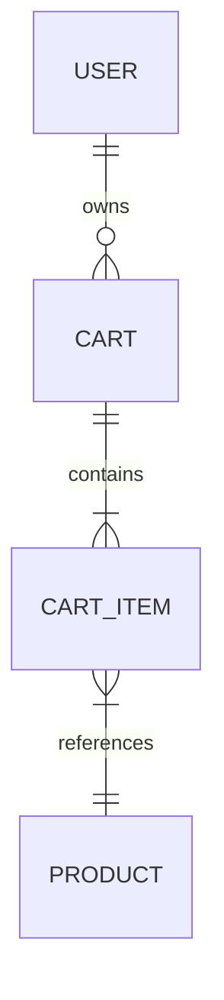

# Low-Level Design Document: Add Items to Shopping Cart (SCRUM-11692)

## 1. Objective
This feature enables customers to add products to their shopping cart from the product listing or details page. The cart will reflect the added items in real-time, showing correct quantity, price, and total cost. The system ensures persistence of cart data across navigation/refresh and proper validation for product existence and stock.

## 2. SpringBoot Backend Details

### 2.1. Controller Layer

#### 2.1.1. REST API Endpoints
| Operation                | REST Method | URL           | Request Body             | Response Body              |
|-------------------------|-------------|---------------|--------------------------|----------------------------|
| Add item to cart        | POST        | /api/cart/add | CartItemAddRequest       | CartResponse               |
| Get cart                | GET         | /api/cart     | -                        | CartResponse               |
| Remove item from cart   | DELETE      | /api/cart/{productId} | -                 | CartResponse               |
| Update item quantity    | PUT         | /api/cart/{productId} | CartItemUpdateRequest | CartResponse               |

#### 2.1.2. Controller Classes
| Class Name         | Responsibility                              | Methods                       |
|--------------------|---------------------------------------------|-------------------------------|
| CartController     | Handles cart-related HTTP requests          | addItem, getCart, removeItem, updateItemQuantity |

#### 2.1.3. Exception Handlers
- GlobalExceptionHandler: Handles validation errors, resource not found, stock issues, etc. Returns appropriate HTTP status codes and messages.

### 2.2. Service Layer

#### 2.2.1. Business Logic Implementation
- Validates product existence and stock.
- Adds new item to cart or increments quantity if already present.
- Calculates total price.
- Persists cart data for the user (session/account-based).

#### 2.2.2. Service Layer Architecture
| Class Name     | Responsibility                                  |
|---------------|--------------------------------------------------|
| CartService   | Implements business logic for cart operations    |
| ProductService| Validates product existence and stock            |

#### 2.2.3. Dependency Injection Configuration
- CartService depends on CartRepository and ProductService.
- ProductService depends on ProductRepository.

#### 2.2.4. Validation Rules
| Field Name    | Validation                          | Error Message                    | Annotation Used   |
|---------------|-------------------------------------|----------------------------------|-------------------|
| productId     | Must exist in DB                    | Product not found                | @ExistsInDb       |
| quantity      | > 0, <= available stock             | Invalid quantity/Out of stock    | @Min, @Max        |
| userId        | Must be valid session/account       | Invalid user                     | Custom/session    |

### 2.3. Repository/Data Access Layer

#### 2.3.1. Entity Models
| Entity      | Fields                                              | Constraints                   |
|-------------|-----------------------------------------------------|-------------------------------|
| Cart        | id, userId, List<CartItem>, totalPrice              | userId unique, not null       |
| CartItem    | id, productId, quantity, price                      | productId FK, quantity > 0    |
| Product     | id, name, price, stock                              | id unique, stock >= 0         |

#### 2.3.2. Repository Interfaces
- CartRepository: CRUD operations for Cart entity (extends JpaRepository/CrudRepository).
- ProductRepository: CRUD operations for Product entity.

#### 2.3.3. Custom Queries (if any)
- Find cart by userId.
- Update quantity for a cart item.

### 2.4. Configuration

#### 2.4.1. Application Properties
- `spring.datasource.url`, `spring.datasource.username`, `spring.datasource.password`
- `spring.jpa.hibernate.ddl-auto=update`
- `server.port=8080`
- Session management properties

#### 2.4.2. Spring Configuration Classes
- SecurityConfig: Configures session/token-based authentication.
- WebConfig: CORS and other web settings.

#### 2.4.3. Bean Definitions
- ModelMapper bean for DTO/entity mapping.
- PasswordEncoder bean (if needed).

### 2.5. Security
- Authentication mechanism: Session or JWT-based (configurable).
- Authorization rules: Only authenticated users can access cart endpoints.
- JWT/Token handling: Secure session tokens required for all cart operations.

### 2.6. Error Handling & Exceptions
- GlobalExceptionHandler annotated with @ControllerAdvice.
- Custom exceptions: ProductNotFoundException, OutOfStockException, CartNotFoundException.
- HTTP Status codes mapping:
  - 404: Product/Cart not found
  - 400: Validation errors
  - 409: Out of stock
  - 401: Unauthorized

## 3. Database Details

### 3.1. ER Model

### 3.2. Table Schema
| Table Name | Columns                          | Data Types         | Constraints                |
|------------|----------------------------------|--------------------|----------------------------|
| user       | id, username, ...                | UUID, VARCHAR, ... | id PK                      |
| cart       | id, user_id, total_price         | UUID, UUID, DECIMAL| id PK, user_id FK          |
| cart_item  | id, cart_id, product_id, quantity, price | UUID, UUID, UUID, INT, DECIMAL | id PK, cart_id FK, product_id FK, quantity > 0 |
| product    | id, name, price, stock           | UUID, VARCHAR, DECIMAL, INT | id PK, stock >= 0         |

### 3.3. Database Validations
- product_id in cart_item must exist in product.
- quantity in cart_item <= product.stock.
- user_id in cart must exist in user.

## 4. Non-Functional Requirements

### 4.1. Performance Considerations
- Support up to 10,000 concurrent users.
- Add to cart operation ≤ 500ms.
- Use indexes on user_id, product_id for fast lookup.

### 4.2. Security Requirements
- All endpoints require authentication.
- Secure session tokens/JWT for cart operations.
- HTTPS enforced.

### 4.3. Logging & Monitoring
- Log all cart operations (add, update, remove).
- Monitor API response times and errors.
- Integrate with ELK/Prometheus if available.

## 5. Dependencies (Maven)
- spring-boot-starter-web
- spring-boot-starter-data-jpa
- spring-boot-starter-security
- spring-boot-starter-validation
- spring-boot-starter-test
- h2/postgresql/mysql driver (as per environment)
- lombok
- modelmapper

## 6. Assumptions
- User authentication/session management is handled (Spring Security/JWT).
- Product data is already present in the database.
- Cart is associated with a logged-in user (userId from session/token).
- In-memory DB (H2) can be used for local/dev; production uses RDBMS.
- Cart data is persisted in DB, not in-memory.

---

**LLD file generated for SCRUM-11692.**
