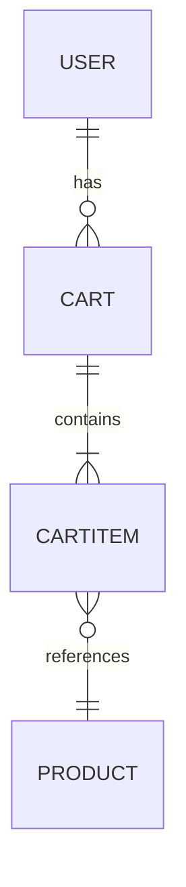

# Low-Level Design Document (LLD) for SCRUM-11692

## 1. Objective
This requirement enables customers to add products to their shopping cart from the product listing or details page. The cart should reflect added items in real-time, update quantities for duplicate additions, and persist cart data across navigation and refresh. The solution must validate product existence and stock, and meet performance and security requirements.

## 2. SpringBoot Backend Details

### 2.1. Controller Layer
#### 2.1.1. REST API Endpoints
| Operation            | REST Method | URL           | Request Body                | Response Body                |
|----------------------|-------------|---------------|-----------------------------|------------------------------|
| Add Item to Cart     | POST        | /api/cart/add | CartItemAddRequest          | CartResponse                 |
| Get Cart             | GET         | /api/cart     | N/A                         | CartResponse                 |
| Remove Item from Cart| DELETE      | /api/cart/item/{productId} | N/A                 | CartResponse                 |
| Update Item Quantity | PUT         | /api/cart/item/{productId} | CartItemUpdateRequest | CartResponse                 |

#### 2.1.2. Controller Classes
| Class Name         | Responsibility                                    | Methods                          |
|--------------------|---------------------------------------------------|----------------------------------|
| CartController     | Handles cart-related HTTP requests                | addItemToCart, getCart, removeItemFromCart, updateItemQuantity |

#### 2.1.3. Exception Handlers
- `@ControllerAdvice` class `GlobalExceptionHandler` to handle:
  - ProductNotFoundException
  - OutOfStockException
  - CartOperationException
  - MethodArgumentNotValidException

### 2.2. Service Layer
#### 2.2.1. Business Logic Implementation
- Validate product existence and stock before adding.
- If product exists in cart, increment quantity; else, add new entry.
- Recalculate cart total after each modification.
- Persist cart data per user session/account.

#### 2.2.2. Service Layer Architecture
- Interface: `CartService`
- Implementation: `CartServiceImpl`
- Methods: addItemToCart, getCart, removeItemFromCart, updateItemQuantity

#### 2.2.3. Dependency Injection Configuration
- Use `@Service` for service classes, `@Autowired` for repository injection.

#### 2.2.4. Validation Rules
| Field Name   | Validation                               | Error Message                    | Annotation Used      |
|--------------|------------------------------------------|----------------------------------|----------------------|
| productId    | NotNull, ExistsInProductDb               | Product not found                | @NotNull, @ExistsInProductDb |
| quantity     | Min(1), Max(100)                         | Quantity must be between 1 and 100| @Min, @Max           |
| stock        | Greater than or equal to quantity        | Product out of stock             | Custom Validator      |

### 2.3. Repository/Data Access Layer
#### 2.3.1. Entity Models
| Entity      | Fields                                         | Constraints                   |
|-------------|-----------------------------------------------|-------------------------------|
| Cart        | id, userId, List<CartItem>, totalPrice         | userId unique, totalPrice >=0 |
| CartItem    | id, productId, productName, price, quantity    | quantity >=1, price >=0       |

#### 2.3.2. Repository Interfaces
- `CartRepository extends JpaRepository<Cart, String>`
- `ProductRepository extends JpaRepository<Product, String>`

#### 2.3.3. Custom Queries (if any)
- Find cart by userId
- Find product by productId

### 2.4. Configuration
#### 2.4.1. Application Properties
- `spring.datasource.*` for DB connection
- `server.port=8080`
- `spring.session.store-type=jdbc` (for session persistence)
- `spring.jackson.serialization.WRITE_DATES_AS_TIMESTAMPS=false`

#### 2.4.2. Spring Configuration Classes
- `@Configuration` class for CORS and security config
- Session management configuration

#### 2.4.3. Bean Definitions
- `ModelMapper` bean for DTO mapping
- `PasswordEncoder` bean if user authentication is required

### 2.5. Security
- Authentication mechanism: JWT token-based authentication (Spring Security)
- Authorization rules: Only authenticated users can access cart APIs
- JWT/Token handling: Validate token on each request, extract userId from token

### 2.6. Error Handling & Exceptions
- Global exception handler with `@ControllerAdvice`
- Custom exceptions: ProductNotFoundException, OutOfStockException, CartOperationException
- HTTP Status codes mapping:
  - 200 OK: Success
  - 400 Bad Request: Validation errors
  - 401 Unauthorized: Invalid/missing token
  - 404 Not Found: Product or cart not found
  - 500 Internal Server Error: Unexpected failures

## 3. Database Details
### 3.1. ER Model

### 3.2. Table Schema
| Table Name | Columns                                  | Data Types         | Constraints              |
|------------|------------------------------------------|--------------------|--------------------------|
| users      | id, username, password, ...              | VARCHAR, ...       | PK: id                   |
| cart       | id, user_id, total_price                 | VARCHAR, VARCHAR, DECIMAL | PK: id, FK: user_id |
| cart_item  | id, cart_id, product_id, product_name, price, quantity | VARCHAR, VARCHAR, VARCHAR, VARCHAR, DECIMAL, INT | PK: id, FK: cart_id, FK: product_id |
| product    | id, name, price, stock                   | VARCHAR, VARCHAR, DECIMAL, INT | PK: id           |

### 3.3. Database Validations
- Foreign key constraints for cart_item → cart and cart_item → product
- Quantity >= 1
- Price >= 0

## 4. Non-Functional Requirements
### 4.1. Performance Considerations
- Support up to 10,000 concurrent users
- Add-to-cart operation ≤ 500ms
- Use efficient indexing on userId, productId

### 4.2. Security Requirements
- All endpoints require JWT authentication
- Use HTTPS for all communications
- Secure session tokens

### 4.3. Logging & Monitoring
- Log all cart operations (add, update, remove)
- Monitor API latency and error rates
- Integrate with centralized logging (e.g., ELK stack)

## 5. Dependencies (Maven)
- spring-boot-starter-web
- spring-boot-starter-data-jpa
- spring-boot-starter-security
- spring-boot-starter-validation
- spring-boot-starter-session
- jjwt (for JWT)
- lombok
- h2/postgresql/mysql driver (as per environment)

## 6. Assumptions
- User authentication is already implemented and userId is available via JWT
- Product catalog exists and is managed separately
- Cart data is stored in a relational DB (JPA/Hibernate)
- Each user has a single active cart
- Product stock is updated in real-time
- Cart persists across user sessions

---

**LLD Filename:** lld/lld_SCRUM-11692.md
